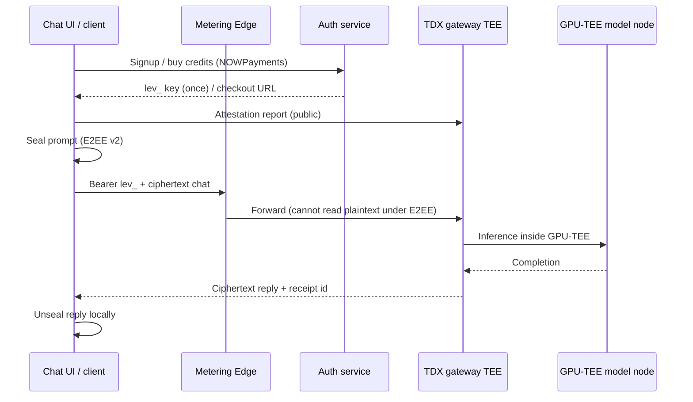

# Confidential AI overview

Leviathan Confidential AI lets you chat with a large language model whose **prompts are processed inside hardware Trusted Execution Environments (TEEs)** — an Intel TDX gateway and an NVIDIA GPU-TEE model node — with optional **end-to-end encryption** so even the metering edge never sees plaintext.

This is a **testnet** surface. Credits are prepaid and billed off-chain. Assets and payments used in the sandbox checkout have **no production settlement meaning** for pioneers testing the flow.

## Two TEE stories (do not conflate them)

Leviathan uses TEEs in more than one place. They solve different problems:

| Path | What runs in the TEE | Who uses it | Docs |
|------|----------------------|-------------|------|
| **Delegated proving** | STARK proof generation for Miden transactions | `leviathan-client` with `--delegate-proving` | [TEE proving overview](../tee/overview.md) |
| **Confidential AI** | LLM inference (gateway + model node) | Browser UI or OpenAI-compatible API | This section |

Both rely on hardware isolation and attestation. Neither replaces on-chain STARK verification, and neither eliminates all operator trust (billing and infrastructure still exist).

## What you get

* **Self-serve accounts** — `POST /v1/signup` issues a `lev_…` API key. No operator mints keys for you.
* **Prepaid credits** — each successful chat completion costs **1 credit**. New accounts start at **0**.
* **Open-weight model** — the live model id is `gpt-oss-120b` (OpenAI’s Apache 2.0 open-weight release). See [The model](model.md).
* **Attestable TEEs** — gateway attestation is a public surface; model-node attestation is documented for builders who verify with the FOSS toolkit.
* **E2EE (ACI v2)** — the hosted chat UI encrypts prompts to the attested enclave keyset so the Edge relays ciphertext only. See [Chat UI](chat-ui.md).
* **Per-key receipts** — successful chats return an `x-receipt-id`; receipts are private to the key that created them.

## Architecture (testnet)

| Component | Testnet URL / role |
|-----------|--------------------|
| Chat UI | [ai-tee-leviathan.up.railway.app](https://ai-tee-leviathan.up.railway.app/) |
| Edge (gateway front) | `https://leviathan-edge.duckdns.org` |
| Auth (signup, credits, validate) | `https://leviathan-auth.duckdns.org` |
| Model id | `gpt-oss-120b` |

The UI talks to Edge and Auth through a **same-origin proxy** on the UI host (`/gw`, `/auth`) so browsers do not need CORS on those services.

## Trust boundaries (honest)

**What TEEs + E2EE are for**

* Processing prompts in CPU-encrypted / GPU-confidential memory rather than an ordinary host process you cannot measure.
* Giving you (or a verifier) cryptographic evidence about enclave composition.
* Keeping plaintext off the metering Edge when E2EE is applied (`x-e2ee-applied: true`).

**What they are not**

* Not a substitute for careful key backup. The auth service stores only the **SHA-256 hash** of your API key and cannot re-show the secret.
* Not free unlimited inference. Credits are prepaid; unpaid chats return HTTP `402`.
* Not Chrome-wallet login. The Leviathan extension authenticates chain accounts; Confidential AI authenticates `lev_` API keys. Binding those identities is future work.
* Not a claim that operators disappear. Auth, Edge, and payment webhooks are still operated infrastructure.

## Start here

1. [Use the Confidential AI chat UI](chat-ui.md) — fastest path for pioneers.
2. [Buy credits (NOWPayments testnet)](credits.md) — sandbox checkout without sending real funds.
3. [The model (`gpt-oss-120b`)](model.md) — what FOSS model you are talking to.
4. [Verify Confidential AI](verify.md) — optional builder path to check attestation and E2EE yourself.
