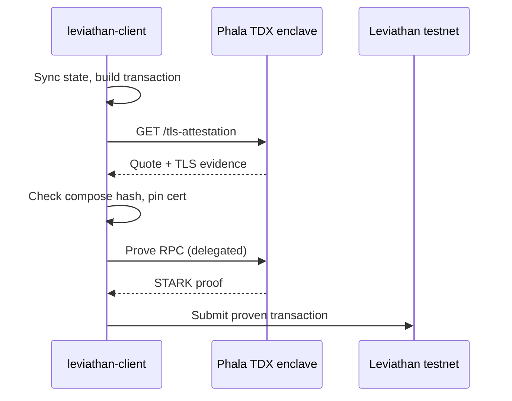

# TEE proving overview

Generating a STARK proof is the expensive part of a Leviathan transaction. The network only needs to verify the proof; your machine (or someone else's) has to produce it first. For simple flows that is fine. For multi-note consumption and heavier private transitions, local proving can take long enough that a laptop feels like the wrong place to do the work.

Delegated TEE proving is Leviathan's answer for testnet builders who want that work done elsewhere without treating the remote machine as a black box. You still build the transaction on your own computer. You still hold the keys. You still submit the proven transaction to the network. What changes is where the proof is computed: inside an Intel TDX confidential VM on Phala Cloud, after your client has checked an attestation of that enclave and pinned its TLS certificate.

This is available today for people running `leviathan-client` with `--delegate-proving`. The hosted browser wallet at [leviathandev.neptune.io/wallet](https://leviathandev.neptune.io/wallet) remains the easiest path for ordinary WXNT sends; the TEE path is the CLI path for pioneers and engineers who need delegated proving.

## Why not just a normal remote prover?

Remote provers are common. Most of them ask you to trust the operator's machines. That may be acceptable for some workloads. It is a weaker story when the prove job can include sensitive transaction material and you have no way to check which binary answered you.

Leviathan's testnet prover is built so the client can answer a narrower question before it sends the job: am I talking to the enclave composition the team published, over a TLS identity I just pinned from that enclave's attestation?

| Approach | What you gain | What you still accept |
|----------|---------------|------------------------|
| Prove locally | Maximum control; no shared prover | Hardware cost and wall-clock time on your machine |
| Ordinary remote prover | Speed and convenience | Trust in an opaque host process |
| Attested TEE prover (this path) | Offloaded proving plus a client-checked enclave measurement | Shared testnet infrastructure, published endpoints, and hash updates after redeploys |

None of these remove the need for sound protocol rules or careful key handling. TEE proving changes the *proving location* and the *evidence* you have about that location. It does not replace [STARK verification](../technology/stark-proofs.md) on the chain.

## Components

Three pieces matter in practice.

**Your client.** `leviathan-client` syncs state, constructs the transaction, optionally delegates proving, and submits the result. Configuration lives under `~/.leviathan/` once you run `init`.

**The enclave.** A Phala Confidential VM runs two processes: the Leviathan remote prover (STARK generation on an internal port) and an attestation proxy that terminates TLS, serves `/tls-attestation`, and forwards prove RPCs into the prover. Clients reach the proxy on ports `50052` (prove) and `50053` (attestation) using Phala URLs with the `s` suffix so TLS ends inside the enclave rather than at a generic gateway.

**The network.** Leviathan testnet still verifies proofs and includes transactions the same way it would if you had proven locally. The TEE is not a consensus participant; it is a proving service your client may use.

## When to use it

Use delegated TEE proving when you are on the CLI path and local proving is too slow or too heavy for the transaction you are testing. Typical candidates:

* Consuming notes after a mint or transfer
* Sends where you want the same attestation path every time
* Repeated pioneer testing where waiting on a laptop prover would dominate the loop

Stay on the browser wallet when you only need the standard pioneer WXNT flow. Stay on local proving when you are debugging client-side execution and want every cycle on your own machine.

## What this documentation covers

* [Attestation and trust](attestation.md) explains measurements, TLS passthrough, image build practices, and honest trust boundaries.
* [Set up delegated TEE proving](setup.md) is the end-to-end CLI guide: build the client, get access, configure endpoints, consume and send with `--delegate-proving`.
* [TEE proving FAQ](faq.md) answers local vs delegated, chat hygiene, hash rotation, and common runtime questions.

Testnet assets have no real-world value. Endpoints and compose hashes are published by the team and will change when the enclave is redeployed. That is expected operations, not an emergency.
